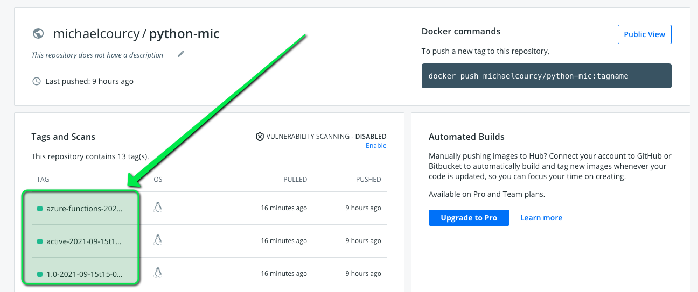

# Include imagestream in kasten backup 

This is a [Kanister](https://docs.kasten.io/latest/kanister/kanister.html) blueprint you can use with [Kasten](https://www.kasten.io) to include your imagestream in the backup of your application.

## Motivation 

In a typical kubernetes deployment scenario, images are deployed in an external registry like docker.io or quay.io. The protection of those registries is not related to the protection of your kubernetes cluster. 

Openshift bring the notion of imagestream that [has many benefits](https://docs.openshift.com/container-platform/4.7/openshift_images/images-understand.html#images-imagestream-use_images-understand) but needs an internal registry (a registry deployed inside the cluster) to work.   this internal registry has some drawbacks : 
*  If you loose your cluster you also loose your images
*  Internal registries are not intended to be open and used as a regular registry, that make migrations of your image from a cluster to another one impossible
*  Images are very often updated by openshift build and my-image:latest on monday could be very different from my-image:latest on tuesday. 

This blueprint ensure that you capture the state of your imagestream with its different tags along your application state. That make migration and restoration of your app seamless.

## How it works

We use skopeo in the [imagestream blueprint](./imagestream-bp.yaml). 
*  At backup skopeo will push the internal images to an external registry
*  At restore skopeo will push the external image to the internal registry 

## Example installation 

### Create a namespace with an imagestreams and tags

```
oc create ns is-test && oc project is-test
oc create is python-mic

# create tags from different image and reference
oc tag --source=docker python:latest                            is-test/python-mic:1.0      
oc tag is-test/python-mic:1.0                                   is-test/python-mic:active   
oc tag --source=docker mcr.microsoft.com/azure-functions/python is-test/python-mic:azure-functions        
# build a django image on top of python:3.8-ubi8  -> python-mic:django 
oc create -f bc.yaml 
oc start-build my-build

# list all the tags we created in this is.
oc get is python-mic -o jsonpath='{.status.tags[*].tag}'    
1.0 active azure-functions django
```


### install the blueprint 

```
oc create imagestream-bp.yaml 
# annotate the is 
oc annotate -n is-test is python-mic kanister.kasten.io/blueprint='imagestream-bp' 
```

In this example I use docker.io for the external registry with my personal account hence my image will look like 
```
docker.io/michaelcourcy/python-mic:1.O-<backup_date>
docker.io/michaelcourcy/python-mic:active-<backup_date>
docker.io/michaelcourcy/python-mic:azure-functions-<backup_date>
```

Create a secret that configure the external and internal registry. 
```
oc create secret generic image-management \
   --from-literal="externalRegistry=docker.io" \
   --from-literal="externalRegistryNamespace=michaelcourcy" \
   --from-literal="externalRegistryUser=michaelcourcy" \
   --from-literal="externalRegistryPwd="<MY_PASSWORD>" \
   --from-literal="internalRegistryBackup=image-registry.openshift-image-registry.svc:5000" \
   --from-literal="internalRegistryRestore=image-registry.openshift-image-registry.svc:5000" 
   -n is-test
```

Kanister pod execute skopeo with the default service account and must pickup the builder secret to push/pull from/to the internal registry.

Make sure service account default can read secret : 
```
oc create role secret-reader --verb=get --verb=list --verb=watch --resource=secrets -n is-test
oc create rolebinding default-secret-reader --role=secret-reader --serviceaccount=is-test:default -n is-test
```

# Backup and restore

Now you can backup this namespace with kasten. You'll see new images in your registry with this names :
```
<your-registry>/<registry-namespace>/python-mic:1.O-<backup_date>
<your-registry>/<registry-namespace>/python-mic:active-<backup_date>
<your-registry>/<registry-namespace>/python-mic:azure-functions-<backup_date>
```



When you restore to another cluster even in another namespace the images will be pushed back to the internal registry of this cluster, creating automatically the imagestream with the imagestream tags.

## To debug the blueprint

Here is a tip to log the temporary kanister pod that will be created to execute skopeo.

```
while true; do oc logs -f -n is-test -l createdBy=kanister; sleep 2; done
```

