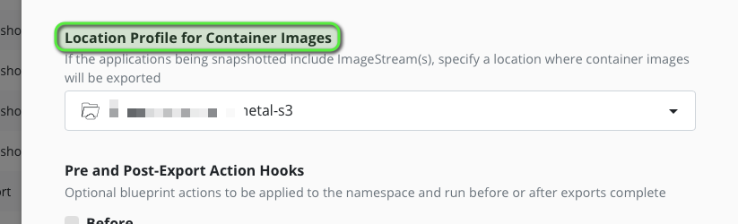

# Include imagestream in kasten backup 

This repo is not anymore a blueprint example for backing up image stream because kasten support them now.

It's more for testing them, I provide several example of ImageStreamTag that you can use to test.


# Important notice for openshift 4.18 and above 

Openshift 4.18 does not enable by default the internal registry depending of you instalation. Kasten will fail in backing up the ImageStreamTag if you don't enable it with the errror message 

```
builder sa cannot get credentials
```

The simplest way to enable it in this case is 
```
oc patch configs.imageregistry.operator.openshift.io/cluster --type merge --patch '{"spec":{"storage":{"emptyDir":{}}}}'
oc patch configs.imageregistry.operator.openshift.io/cluster --type merge --patch '{"spec":{"managementState":"Managed"}}'
```


## Create various imageStreams 

```
oc create ns is-test && oc project is-test
oc create is python-mic

# create tags from different image and reference
oc tag --source=docker python:latest is-test/python-mic:1.0      
oc tag is-test/python-mic:1.0 is-test/python-mic:active   
oc tag --source=docker mcr.microsoft.com/azure-functions/python is-test/python-mic:azure-functions        

# build a django image on top of python:3.8-ubi8 with a source strategy
oc -n openshift create is python
oc tag --source=docker registry.access.redhat.com/ubi8/python-38 openshift/python:3.8-ubi8    
oc create -f bc1.yaml 
oc start-build source-build-config
oc logs buildconfig/source-build-config -f

# build a dummy image on top of alpine with a docker strategy
oc create is alpine-is
oc create -f bc2.yaml 
oc start-build docker-build-config
oc logs buildconfig/docker-build-config


# list all the tags we created in this is.
oc get is
```


# Backup and restore

Now you can backup this namespace with kasten ensure you specify the profile for image location



You also may need to increase the value of ephemeralPVCOverhead when the image are taking more space than the temporary PVC we create for them :

```
--set ephemeralPVCOverhead="O.3"
```

Often fix the issue 
```
stdout: error writing layer: write
          /var/lib/image/a88f54a406786a52a1293bf1ce8251745a0187caf9c3a654717e2a\
          de07dd722d/blobs/sha256/b82ddf37e40febb44c258077df217aef2b72f65c2c190\
          ecd3a165ae894256e113723449066: no space left on device

          stderr: imagemover pull IMAGE TARBALL [flags]\r
```